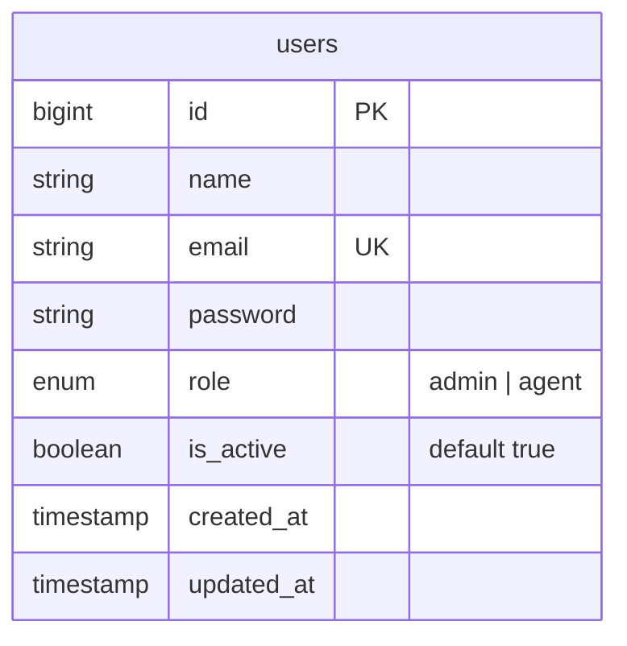

# Story 06 — Users table with role enum and a seeded admin (Story: TM-8)

## Prerequisites

- **Story 02 (TM-3) must be _implemented_, not merely planned:** [`../foundation-environment/02-story-install-configure-laravel-13-api-TM-3.md`](../foundation-environment/02-story-install-configure-laravel-13-api-TM-3.md). This is the hardest blocker in the project so far, because **nothing in this story can be run without it**:
  - `php -r 'echo implode(",", PDO::getAvailableDrivers());'` in `backend/` prints **`pgsql`** — `pdo_mysql` is not installed, so `php artisan migrate` fails with "could not find driver". You cannot apply the migration, seed, or run a single test in this story's test plan.
  - `composer test` exits `1` before PHPUnit starts (the `@no_additional_args` token on `backend/composer.json:49`). TM-3 task 2 removes it.

  Confirm before starting: `php artisan migrate --pretend` runs without a driver error, and `composer test` exits `0`.
- **Docker services running:** repo root — `docker compose up -d` and all three containers `healthy`. The suite migrates against `127.0.0.1:3307` (`backend/phpunit.xml:38`).
- **Stories 04 (TM-5) and 05 (TM-6) are not blockers.** TM-5 only improves the readiness signal on the containers this story's tests connect to; TM-6 adds the CI that will run them.
- **This is the first story in the `authentication-agent` feature.** `00-overview.md` is still the empty template — task 8 fills in its header rows as well as this story's.
- **Verified: no migration has ever run.** `SHOW TABLES` in both `ticket_management` and `ticket_management_test` returns **nothing**. This is what makes task 2 (editing the existing `create_users_table` migration in place, rather than adding a second one) safe rather than merely convenient — there is no database anywhere holding the old shape.

---

## Story Goal

Give `users` a role and an active flag, make a PHP enum the only place the role strings are written, and replace the stock `Test User` seeder with an idempotent admin built from the environment.

Audit of the four acceptance criteria against the code as it stands:

| # | Criterion | Verdict |
|---|---|---|
| 1 | `users` has `name`, `email` (unique), `password`, `role enum('admin','agent')`, `is_active`, timestamps | ⚠️ **Half met.** `database/migrations/0001_01_01_000000_create_users_table.php:14-22` already has `name`, `email`→`unique()`, `password` and `timestamps()`. **`role` and `is_active` do not exist.** |
| 2 | A PHP 8.3 backed enum `UserRole` is the single definition of the role values | ❌ **Not met.** `app/Enums/` does not exist — `find app -type d` returns only `Http`, `Http/Controllers`, `Http/Controllers/Api`, `Http/Controllers/Api/V1`, `Models`, `Providers`. |
| 3 | Seeder creates one admin whose credentials come from environment variables, not hardcoded | ❌ **Not met.** `database/seeders/DatabaseSeeder.php:20-23` hardcodes `'Test User'` / `'test@example.com'`. `backend/.env.example:63-66` documents `ADMIN_NAME`, `ADMIN_EMAIL` and `ADMIN_PASSWORD`, and **nothing reads them** — TM-3's plan left that block annotated as this story's. |
| 4 | The seeder is idempotent and safe to run twice | ❌ **Not met.** `User::factory()->create([...])` inserts unconditionally, and `email` carries a unique index (migration line 17), so a second `db:seed` fails on the constraint. |

Five outcomes:

1. `app/Enums/UserRole.php` is the only file in the repository containing the strings `'admin'` and `'agent'` as role values — the **migration reads its column domain from the enum**, so the two cannot drift.
2. `users.role` is a real MySQL `enum('admin','agent')` with an explicit default of `'agent'`, and `users.is_active` is a boolean defaulting to `true`.
3. `User` casts `role` to `UserRole` and `is_active` to `bool`, and **`role` is deliberately not mass-assignable**.
4. `AdminUserSeeder` creates one admin from `config('seeding.admin.*')`, refuses to run without an `ADMIN_PASSWORD`, and on a second run leaves the existing record **completely untouched** — including a password the admin has since changed.
5. `php artisan migrate:fresh --seed` on a clean database produces exactly one user, an admin, who can be logged in as soon as TM-9 exists.

**Not in scope:** the login endpoint and token issuing (**TM-9**), logout (**TM-10**), SPA session handling (**TM-11**), admin CRUD for agent accounts (**TM-12**), policies and gates (**TM-13**), password change (**TM-14**), the demo/dev data seeder and richer factories (**TM-59**), any master-data or ticket table (**TM-16**, **TM-21**), and any change under `frontend/`. **Nothing enforces `is_active` yet** — see the note below; the column exists so TM-9 has something to check.

---

## Product rules — a measured MySQL behaviour that decides task 2

The obvious way to write an `enum` column that must always be set is to give it no default and let the database reject an insert that omits it. **For a MySQL `ENUM` that does not work, and the failure mode is a silent privilege escalation.** Measured against `tm-mysql-test` (MySQL 8.4, `sql_mode` = `ONLY_FULL_GROUP_BY,STRICT_TRANS_TABLES,NO_ZERO_IN_DATE,NO_ZERO_DATE,ERROR_FOR_DIVISION_BY_ZERO,NO_ENGINE_SUBSTITUTION`):

```sql
CREATE TABLE p1 (id int PRIMARY KEY, role enum('admin','agent') NOT NULL);
-- information_schema reports COLUMN_DEFAULT = NULL, i.e. "no default"
INSERT INTO p1 (id) VALUES (1);
SELECT id, role FROM p1;
```
```
id  role
1   admin      <-- inserted, not rejected
```

A `NOT NULL` `ENUM` takes **the first enumerated value** as its implicit default, even under `STRICT_TRANS_TABLES`, and `information_schema.COLUMN_DEFAULT` still says `NULL` so nothing warns you. Because `UserRole::cases()` declares `Admin` first, *any* code path that inserts a user without setting a role would silently create an **administrator**.

With an explicit default, the behaviour is what you want:

```sql
CREATE TABLE p2 (id int PRIMARY KEY, role enum('admin','agent') NOT NULL DEFAULT 'agent');
INSERT INTO p2 (id) VALUES (1);   -- role = 'agent'; COLUMN_DEFAULT = 'agent'
INSERT INTO p2 (id, role) VALUES (2, 'manager');
-- ERROR 1265 (01000): Data truncated for column 'role' at row 1
```

So task 2 sets `->default(UserRole::Agent)`. Two consequences to carry through the rest of the plan:

- **Least privilege is the default, by construction.** An omitted role produces an agent. This is also what makes keeping `role` out of `#[Fillable]` (task 3) safe rather than fragile: a payload that smuggles `role` is ignored, and the resulting user is an agent.
- **Out-of-range values are still rejected** — `ERROR 1265`, which is an *error* only because `config/database.php` sets `'strict' => true`. In a non-strict connection the same insert stores `''` with a warning. The test plan pins the rejection; do not "simplify" the column to a `string` and lose it.

---

## Context — Read These Files First

1. `backend/database/migrations/0001_01_01_000000_create_users_table.php` — all 49 lines. The `users` block is **14–22**; `password` is line 19 and `rememberToken()` line 20, which is where task 2 inserts two columns. Note the file also creates `password_reset_tokens` (24–28) and `sessions` (30–37) — **leave both alone**; `SESSION_DRIVER=database` (`.env.example:34`) means `sessions` is live.
2. `backend/app/Models/User.php` — all 32 lines. `#[Fillable(['name', 'email', 'password'])]` on line 13 and `#[Hidden(['password', 'remember_token'])]` on 14 — **PHP attributes, not `protected $fillable`**; CLAUDE.md calls this the house idiom and task 3 must match it. `casts()` is 25–31 and already has `'password' => 'hashed'`.
3. `backend/database/seeders/DatabaseSeeder.php` — all 24 lines. `run()` is 16–24; the hardcoded `Test User` is 20–23 and the commented `User::factory(10)` on 18. `use WithoutModelEvents;` on line 11 stays.
4. `backend/database/factories/UserFactory.php` — all 45 lines. `definition()` is 25–34; note **line 31**, `static::$password ??= Hash::make('password')`. Read the double-hash note below before deciding whether that fights the `hashed` cast — it does not, and the reason is verifiable.
5. `backend/.env.example` — lines **63–66**:

   ```
   # Credentials for the admin created by DatabaseSeeder. Change before any real use.
   ADMIN_NAME="Admin"
   ADMIN_EMAIL=admin@ticket-management.test
   ADMIN_PASSWORD=password
   ```

   These are the variables acceptance criterion 3 means. Task 5 edits only the comment.
6. `backend/config/database.php` — the `mysql` connection block. **`'strict' => true`** is the line that turns an out-of-range enum value into an exception instead of a warning, and `'charset' => utf8mb4` / `'collation' => utf8mb4_unicode_ci` are why a name in Arabic is storable.
7. `backend/config/` — list it. There is **no** project-specific config file (only Laravel's twelve). Task 5 adds the first one; read "Why the seeder reads config, not `env()`" before deciding otherwise.
8. `backend/phpunit.xml` — the comment at **27–35** names `ENUM columns` as one of the three reasons the suite runs against real MySQL. This story is the first one that makes that comment load-bearing. Lines 36–39 pin the connection.
9. `backend/tests/` — three files: `Feature/ExampleTest.php`, `Unit/ExampleTest.php`, `TestCase.php`. `TestCase.php` is an empty subclass (9 lines), and **`RefreshDatabase` is used nowhere yet** — it appears only as a commented import at `Feature/ExampleTest.php:5`. Every test this story adds is the first of its kind; there is no local pattern to copy, so match `../foundation-environment/02-…-TM-3.md`'s test-plan style instead.
10. `docs/erd.md` — all 20 lines. A placeholder with a `## Diagram` section awaiting a Mermaid `erDiagram` and a **`| Table | Purpose | Owning story |`** table whose only row is `_(none yet)_`. Task 7 adds the `users` row; this is the first schema story, so it opens that file the way TM-3 opened `docs/api-contract.md`.
11. Framework facts worth confirming yourself rather than trusting this plan (each was read during planning):
    - `vendor/laravel/framework/src/Illuminate/Database/Eloquent/Concerns/HasAttributes.php:1493` — `castAttributeAsHashedString()` calls `Hash::isHashed($value)` first and returns the value untouched if it is already a hash. **The `hashed` cast never double-hashes**, which is why `UserFactory:31`'s `Hash::make('password')` is safe.
    - `vendor/laravel/framework/src/Illuminate/Database/Eloquent/Factories/Factory.php:523` — `makeInstance()` wraps model construction in `Model::unguarded(...)`. **Factories bypass `$fillable` entirely**, which is why task 4 can set a non-fillable `role` and task 3 can still exclude it.
    - `vendor/laravel/framework/src/Illuminate/Database/Schema/Grammars/Grammar.php` — `getDefaultValue()` handles `UnitEnum` via `enum_value()`, so `->default(UserRole::Agent)` compiles to `'agent'` and the literal stays inside the enum.
    - `vendor/laravel/framework/src/Illuminate/Database/Schema/Builder.php:363` — `getColumnType($table, $column, $fullDefinition = true)` returns the driver's full type string. Against MySQL that is exactly `enum('admin','agent')` (the grammar selects `column_type as 'type'`, `MySqlGrammar.php:147`). This is the assertion the schema test uses.
    - `vendor/laravel/framework/src/Illuminate/Database/Seeder.php:26` — `protected $command`, propagated to child seeders in `resolve()` (136–137). Guard console output with `isset($this->command)`, which is Laravel's own idiom in that file.

---

## Why the seeder reads config, not `env()`

`env()` returns **`null`** once `php artisan config:cache` has run — the cached config file is loaded instead of `.env`, and the `$_ENV` those calls read is not repopulated. A seeder that calls `env('ADMIN_EMAIL')` therefore works on every developer machine and fails on the first config-cached deploy, creating a user with a `null` email (a MySQL error) or, worse, silently falling back to a default password.

Task 5 adds **`backend/config/seeding.php`** so the `env()` calls live where Laravel expects them — inside a config file, evaluated before caching. `config/seeding.php` is a new file because there is no project-specific config file yet; note that `.env.example:70`'s `TICKETS_STALE_AFTER_HOURS` (owned by **TM-43**) is *not* seeding configuration and must not be added to it.

---

## Backend Tasks

**No frontend changes.** Nothing under `frontend/` is read or written; the login UI that consumes this schema is TM-9 and TM-11.

### 1 — The enum

**Create file: `backend/app/Enums/UserRole.php`**

`app/Enums/` does not exist; create the directory. `composer.json`'s PSR-4 map already covers `App\` → `app/`, so no autoload change is needed.

```php
<?php

namespace App\Enums;

/**
 * The two kinds of login this product has. Requesters are contact records,
 * not users, so they are deliberately absent.
 *
 * This enum is the single definition of the role values: the users migration
 * builds its ENUM column from self::values(), and the model casts to it. A
 * value added here reaches the database through a migration, never by editing
 * a string in two places.
 */
enum UserRole: string
{
    case Admin = 'admin';
    case Agent = 'agent';

    /**
     * The backing values, in declaration order — the column domain.
     *
     * @return list<string>
     */
    public static function values(): array
    {
        return array_column(self::cases(), 'value');
    }
}
```

`values()` exists for the migration. Validation rules do **not** need it — TM-12 should use `Rule::enum(UserRole::class)` rather than `Rule::in(UserRole::values())`, because the former also rejects a valid-looking string with the wrong case.

**No `label()` method.** Nothing in the backend renders a role for humans, and the SPA owns its own display strings. Add one when a story actually needs it.

### 2 — The migration

**File: `backend/database/migrations/0001_01_01_000000_create_users_table.php`**

Edit the existing file rather than adding a second migration. Both databases are empty (`SHOW TABLES` returns nothing in each), so there is no deployed shape to preserve, and a second migration altering a table created twelve lines earlier in the same batch is noise a future reader has to reconcile.

Add the import at the top, after the opening `<?php` and before the `Illuminate` imports:

```php
use App\Enums\UserRole;
```

Then insert two columns into the `users` block, between `password` (line 19) and `rememberToken()` (line 20):

```php
            $table->string('password');

            // The column domain comes from the enum, so the two cannot drift.
            // The explicit default is NOT cosmetic: a NOT NULL MySQL ENUM with
            // no default silently takes its FIRST value, which is 'admin' —
            // an insert that forgot to set a role would create an
            // administrator. Defaulting to the least-privileged role means the
            // same mistake creates an agent instead.
            $table->enum('role', UserRole::values())->default(UserRole::Agent);

            // Deactivating beats deleting: an agent who leaves keeps their
            // name on the tickets they handled. Nothing enforces this at login
            // yet — that is TM-9.
            $table->boolean('is_active')->default(true);

            $table->rememberToken();
```

Leave `down()` unchanged — it already drops `users`.

Three things deliberately **not** done here:

- **No index on `role` or `is_active`.** Both columns have two possible values, so MySQL will table-scan regardless of an index on a table this size, and an unused index still costs every write. When TM-12 lists agents and the plan shows a real cost, add it there with a measurement.
- **`email_verified_at` (line 18) and `rememberToken()` stay.** Neither is used — auth is Sanctum bearer tokens with no session (`backend/routes/api.php` header) and there is no verification flow — but `User::casts()` references `email_verified_at`, `#[Hidden]` references `remember_token`, and `UserFactory` sets both. Removing them is three files of churn for two harmless columns, and no story owns it. Leave them.
- **No `deleted_at`.** Soft deletes on `users` are not in any story; TM-28 soft-deletes *tickets*.

### 3 — The model

**File: `backend/app/Models/User.php`**

Add the import, extend the attributes, extend `casts()`, and add one helper:

```php
use App\Enums\UserRole;
```

```php
#[Fillable(['name', 'email', 'password', 'is_active'])]
#[Hidden(['password', 'remember_token'])]
class User extends Authenticatable
```

**`role` is deliberately absent from `#[Fillable]`.** Mass-assigning a role is the textbook privilege-escalation bug: one controller doing `User::create($request->validated())` with `role` in the payload is all it takes. Setting it explicitly costs one line at each of the two places that legitimately do (the seeder in task 6, and TM-12's admin CRUD), and factories are unaffected because `Factory::makeInstance()` runs inside `Model::unguarded()`. `is_active` **is** fillable — flipping it is a normal administrative action with no escalation path.

```php
    /**
     * Get the attributes that should be cast.
     *
     * @return array<string, string>
     */
    protected function casts(): array
    {
        return [
            'email_verified_at' => 'datetime',
            'password' => 'hashed',
            'role' => UserRole::class,
            'is_active' => 'boolean',
        ];
    }

    /**
     * Admin is the only elevated role, so every capability check in this
     * product reduces to this question. Gates and policies are TM-13.
     */
    public function isAdmin(): bool
    {
        return $this->role === UserRole::Admin;
    }
```

The `casts()` method — not a `protected $casts` array — is the existing idiom in this file and what CLAUDE.md documents.

No `isAgent()`: with two roles, `! $user->isAdmin()` says it, and a third role would have to revisit both methods anyway. No `scopeActive()` — add it in the story that first lists users (TM-12).

### 4 — The factory

**File: `backend/database/factories/UserFactory.php`**

Add `role` and `is_active` to `definition()` (lines 25–34) and three states. TM-59 owns the demo seeder and any richer factory; this is the minimum TM-9 through TM-14 will need to write tests against.

```php
use App\Enums\UserRole;
```

```php
    public function definition(): array
    {
        return [
            'name' => fake()->name(),
            'email' => fake()->unique()->safeEmail(),
            'email_verified_at' => now(),
            'password' => static::$password ??= Hash::make('password'),
            'remember_token' => Str::random(10),
            // Agent, not admin: a test that needs elevated rights should have
            // to say so. ->admin() is one call; a privileged default is a
            // whole category of tests that pass for the wrong reason.
            'role' => UserRole::Agent,
            'is_active' => true,
        ];
    }

    /**
     * Indicate that the user is an administrator.
     */
    public function admin(): static
    {
        return $this->state(fn (array $attributes) => [
            'role' => UserRole::Admin,
        ]);
    }

    /**
     * Indicate that the user is an agent. Explicit for readability at the
     * call site, even though it matches the default.
     */
    public function agent(): static
    {
        return $this->state(fn (array $attributes) => [
            'role' => UserRole::Agent,
        ]);
    }

    /**
     * Indicate that the user's account is deactivated.
     */
    public function inactive(): static
    {
        return $this->state(fn (array $attributes) => [
            'is_active' => false,
        ]);
    }
```

Keep `unverified()` (lines 39–44) and **keep line 31 exactly as it is.** `Hash::make('password')` alongside the `hashed` cast does not double-hash: the cast calls `Hash::isHashed()` first and returns an already-hashed value untouched (`HasAttributes.php:1493`). Changing it to a plain `'password'` would also work, but the current form keeps one hash per test run rather than one per user.

### 5 — Configuration

**Create file: `backend/config/seeding.php`**

```php
<?php

return [

    /*
    |--------------------------------------------------------------------------
    | First administrator
    |--------------------------------------------------------------------------
    |
    | AdminUserSeeder reads these. They live in a config file, not in env()
    | calls inside the seeder, because env() returns null once
    | `php artisan config:cache` has run — a seeder calling it directly works
    | on every developer machine and fails on the first cached deploy.
    |
    | `password` has NO default on purpose. Falling back to a literal would
    | mean a production install that forgot ADMIN_PASSWORD silently gets an
    | administrator whose password is in this repository. The seeder refuses
    | to run instead.
    |
    */

    'admin' => [
        'name' => env('ADMIN_NAME', 'Admin'),
        'email' => env('ADMIN_EMAIL', 'admin@ticket-management.test'),
        'password' => env('ADMIN_PASSWORD'),
    ],

];
```

**File: `backend/.env.example`** — replace the comment on line 63 so it points at the mechanism, and record that the password is read only when the admin does not yet exist. Change the three variable lines' **values** not at all:

```dotenv
# The first administrator, created by AdminUserSeeder via config/seeding.php.
# ADMIN_PASSWORD has no fallback: the seeder aborts if it is empty rather than
# create an admin with a guessable password. It is read only when that email
# does not already exist — the seeder never overwrites an existing account, so
# changing this later does not change a password that has already been set.
ADMIN_NAME="Admin"
ADMIN_EMAIL=admin@ticket-management.test
ADMIN_PASSWORD=password
```

Do **not** add these to `backend/phpunit.xml`. Task 6's test sets them per-test with `config()->set(...)`, so an assertion cannot pass by coincidentally matching a value the suite already provides.

### 6 — The seeders

**Create file: `backend/database/seeders/AdminUserSeeder.php`**

```php
<?php

namespace Database\Seeders;

use App\Enums\UserRole;
use App\Models\User;
use Illuminate\Database\Seeder;
use RuntimeException;

class AdminUserSeeder extends Seeder
{
    /**
     * Create the first administrator, if there is not one already.
     *
     * Idempotent by construction: an existing account with this email is left
     * exactly as it is. firstOrCreate/updateOrCreate would both be wrong here
     * — updateOrCreate resets the password on every run, so a `migrate --seed`
     * against a live database would silently revert an admin's own password
     * change back to whatever ADMIN_PASSWORD happens to hold.
     */
    public function run(): void
    {
        $email = config('seeding.admin.email');
        $password = config('seeding.admin.password');

        if (blank($password)) {
            throw new RuntimeException(
                'ADMIN_PASSWORD is empty. Set it in .env — refusing to seed an '
                .'administrator with a default password.'
            );
        }

        $admin = User::firstOrNew(['email' => $email]);

        if ($admin->exists) {
            if (isset($this->command)) {
                $this->command->getOutput()->writeln(
                    "  <fg=yellow>Admin {$email} already exists — left untouched.</>"
                );
            }

            return;
        }

        $admin->fill([
            'name' => config('seeding.admin.name'),
            // Plain text on purpose: the model's `hashed` cast hashes it on
            // save. Calling Hash::make() here as well would be harmless (the
            // cast checks Hash::isHashed first) but misleading.
            'password' => $password,
            'is_active' => true,
        ]);

        // Not mass-assignable — see the #[Fillable] note in app/Models/User.php.
        $admin->role = UserRole::Admin;

        $admin->save();

        if (isset($this->command)) {
            $this->command->getOutput()->writeln(
                "  <fg=green>Admin {$email} created.</>"
            );
        }
    }
}
```

`isset($this->command)` rather than `$this->command?->…`: the property is untyped (`Seeder.php:26`) and Laravel's own `call()` guards it exactly this way, so a seeder invoked from a test — where no console command exists — stays silent instead of erroring.

**File: `backend/database/seeders/DatabaseSeeder.php`**

Replace `run()` (lines 16–24). The `Test User` goes; a fresh install should contain the admin and nothing else.

```php
    /**
     * Seed the application's database.
     *
     * Only what a fresh install needs to be usable. Demo and development data
     * is TM-59; master data (categories, priorities, statuses) is TM-16 and
     * will be added to this list.
     */
    public function run(): void
    {
        $this->call([
            AdminUserSeeder::class,
        ]);
    }
```

Keep `use WithoutModelEvents;` on line 11 and drop the now-unused `use App\Models\User;` import — an unused import is a Pint finding, and `./vendor/bin/pint --test` must stay green (TM-6).

### 7 — Documentation

**File: `docs/erd.md`**

The first schema story opens this file. Replace the `## Diagram` placeholder body (lines 13–14) with a Mermaid diagram holding the one table that now exists, and add the `users` row to the table notes (line 20, replacing `_(none yet)_`):

````markdown
## Diagram



## Table notes

| Table | Purpose | Owning story |
|-------|---------|--------------|
| `users` | Logins. **Admin** and **Agent** only — requesters are contact records, not users. `role` is a MySQL `ENUM` built from `App\Enums\UserRole`; it defaults to `agent` because a `NOT NULL` MySQL `ENUM` with no explicit default silently takes its first value. | TM-8 |
````

Leave the `> **Placeholder.**` note on lines 3–4 in place — the file is still incomplete, and TM-16 and TM-21 add the rest.

**Do not** edit `CLAUDE.md`. Its "Models use PHP attributes, not properties" section stays accurate, and its claim that the project has "the default user table" becomes stale — correcting it is worth doing, but `CLAUDE.md` is already being edited by TM-6 and a second story editing the same lines in the same sprint is a merge conflict for no benefit. Record it in the overview instead.

---

## Edge Cases & Failure Modes

- **A `NOT NULL` MySQL `ENUM` with no explicit default silently stores its first value.** Measured: `INSERT INTO p1 (id) VALUES (1)` on `enum('admin','agent') NOT NULL` inserts `role = 'admin'` under `STRICT_TRANS_TABLES`, while `information_schema.COLUMN_DEFAULT` reports `NULL`. Because `UserRole::Admin` is declared first, dropping `->default(UserRole::Agent)` from task 2 turns every forgotten role into an administrator. This is the single most important line in the story.
- **An out-of-range role value.** `INSERT … role = 'manager'` raises `ERROR 1265 (01000) Data truncated for column 'role'` → a `QueryException`. It is an **error** only because `config/database.php` sets `'strict' => true`; on a non-strict connection MySQL stores `''` and warns. Do not change that setting, and do not replace the `ENUM` with a `string` — the database is the last line of defence for the column's domain.
- **`role` reachable by mass assignment.** Adding `'role'` to `#[Fillable]` makes `User::create($request->validated())` a privilege-escalation vector the moment any endpoint accepts a `role` key. It is excluded, so the seeder and TM-12 set it explicitly; the test plan asserts the exclusion so a future edit has to delete a test to reintroduce the hole.
- **Factories appearing to ignore `#[Fillable]`.** They do ignore it: `Factory::makeInstance()` wraps construction in `Model::unguarded()` (`Factory.php:523`). This is why `UserFactory::admin()` can set a non-fillable `role`. Do not conclude from a passing factory test that mass assignment is open.
- **Double-hashing the password.** `casts()` maps `password => hashed`, and `castAttributeAsHashedString()` calls `Hash::isHashed()` first (`HasAttributes.php:1493`), returning an already-hashed value untouched. So the seeder passes plain text and the factory passes a hash, and both are correct. Wrapping the seeder's value in `Hash::make()` is harmless but wrong to read; wrapping it **twice** — `Hash::make()` plus a manual `bcrypt()` — produces a password nobody can log in with, and the failure surfaces only in TM-9.
- **`env()` inside the seeder.** Returns `null` after `php artisan config:cache`, so the seeder would either insert a `null` email (SQL error) or fall through to a default. `config/seeding.php` exists for this reason; a future story must not "simplify" the seeder back to `env()`.
- **`ADMIN_PASSWORD` empty or absent.** The seeder throws a `RuntimeException` naming the variable. The alternative — a fallback literal — means a forgotten variable produces an administrator whose password is published in this repository. `migrate --seed` fails loudly and the migration is already committed, so re-running after fixing `.env` is safe (the seeder is idempotent).
- **Running the seeder twice.** `firstOrNew` + an early return on `$admin->exists` leaves the existing row byte-identical. **`updateOrCreate` would be a bug**, not a style choice: it rewrites `password` on every run, so a routine `php artisan migrate --seed` on a shared database reverts an admin's own password change back to whatever `ADMIN_PASSWORD` holds, and `is_active` back to `true` for an account somebody deliberately disabled.
- **`ADMIN_EMAIL` changed after the first seed.** The next run finds no user with the new email and creates a **second** admin; the old one stays. That is the honest behaviour for an idempotent seeder keyed on email — it cannot know whether you renamed the admin or added one. Changing an existing admin's email is TM-12's job, not the seeder's.
- **Editing an existing migration.** Anyone who has already run `php artisan migrate` gets no new columns — the row in `migrations` marks the file as applied. Verified safe today (both databases are empty, and `pdo_mysql` is missing so nobody *can* have migrated), but the moment a teammate has migrated, the fix is `php artisan migrate:fresh --seed`, which **destroys local data**. See Migration / Rollback.
- **`is_active` enforced nowhere.** This story adds the column and the cast; no code checks it. A deactivated user can still authenticate the instant TM-9's login endpoint exists. **TM-9 must reject a login where `is_active` is false**, and **TM-10/TM-11** must not treat an existing token as proof of an active account. Recorded in the overview so it is not discovered by a departed agent logging in.
- **Names and emails outside ASCII.** `config/database.php` pins `utf8mb4` / `utf8mb4_unicode_ci` and both containers run with those server defaults (`docker-compose.yml:25-26`), so `ADMIN_NAME="مدير النظام"` stores and reads back intact. The `string` columns need no change; a future migration adding a role column elsewhere must keep the same charset.
- **`config:cache` stale after editing `config/seeding.php`.** A cached config file is not invalidated by editing its source. `composer test` clears it first (`composer.json:48`, `config:clear`), but a manual `php artisan db:seed` after a `config:cache` reads the old values. Run `php artisan config:clear` if a seed uses credentials you know you changed.
- **`Test User` referenced somewhere.** `grep -rn "test@example.com" backend/app backend/tests backend/database` before deleting it, and after. Nothing references it today; TM-3's planned `HealthTest` does not, and TM-59 will build its own data.

---

## Migration / Rollback

The schema change lands by **editing an applied-in-principle migration**, so the rules are unusual enough to state explicitly.

**On a database that has never migrated** (the current state everywhere — both `SHOW TABLES` are empty):

```bash
cd backend
php artisan migrate --seed
```

**On a database that has already run the old `create_users_table`:** the file's checksum is not tracked, so Laravel considers it applied and `php artisan migrate` is a no-op. `users` will have no `role` column and every test in this story fails on a missing column. The only fix is a rebuild, which **destroys local data**:

```bash
cd backend
php artisan migrate:fresh --seed
```

If local data must survive, write a throwaway `ALTER TABLE` migration instead — but do not commit it, because the edited base migration already produces the right shape on a fresh install and a committed alter would run twice on the next `migrate:fresh`.

**Rollback:** `git checkout -- backend/database/migrations/0001_01_01_000000_create_users_table.php backend/app/Models/User.php backend/database/factories/UserFactory.php backend/database/seeders/ backend/.env.example`, `rm backend/app/Enums/UserRole.php backend/config/seeding.php backend/database/seeders/AdminUserSeeder.php`, then `php artisan migrate:fresh` from `backend/`. Half-applied states to watch for:

- **Enum deleted, migration still importing it.** Every artisan command dies at class resolution — `Class "App\Enums\UserRole" not found` — including `migrate:fresh`. Restore the enum before rolling anything else back.
- **Migration applied, model not updated.** `role` reads back as the raw string `'agent'` instead of `UserRole::Agent`, and `$user->isAdmin()` is a fatal error on a `null` method call. Symptom in tests: a comparison against `UserRole::Admin` that is always false.
- **`config/seeding.php` missing but the seeder present.** `config('seeding.admin.password')` returns `null`, the guard fires, and the exception names `ADMIN_PASSWORD` — which is set. If the message looks wrong, check that the config file exists before checking `.env`.

---

## Test Plan

`composer test` from `backend/`, against `tm-mysql-test` on port 3307. **Every test here needs `pdo_mysql`** (TM-3 task 1) and every feature test needs `RefreshDatabase`, which nothing in the suite uses yet — these files establish that pattern. Import `Illuminate\Foundation\Testing\RefreshDatabase` explicitly; `tests/TestCase.php` is an empty subclass and must stay that way.

1. **Create `backend/tests/Unit/Enums/UserRoleTest.php`** — no database, no `RefreshDatabase`. Four tests:
   - `has exactly two cases` — `UserRole::cases()` has 2 elements. Pins the product rule that requesters are not users; a third role has to change this test on purpose.
   - `backs its cases with the documented strings` — `UserRole::Admin->value === 'admin'`, `UserRole::Agent->value === 'agent'`. These strings are in the database, so renaming a case is a migration, not a refactor.
   - `values returns the column domain in declaration order` — `UserRole::values() === ['admin', 'agent']`. **Order matters**: it is what the migration's `enum()` emits, and the first element is MySQL's implicit default.
   - `tryFrom rejects an unknown role` — `UserRole::tryFrom('manager')` is `null`.

2. **Create `backend/tests/Feature/Database/UsersTableSchemaTest.php`** — `RefreshDatabase`. This is the class the `phpunit.xml` comment about ENUM columns was written for; against SQLite every assertion here would be meaningless. Six tests:
   - `has the columns the story requires` — `Schema::hasColumns('users', ['name', 'email', 'password', 'role', 'is_active', 'created_at', 'updated_at'])` is true.
   - `types role as a MySQL enum over the UserRole values` — `Schema::getColumnType('users', 'role', fullDefinition: true)` equals **`"enum('admin','agent')"`**. Verified during planning as the exact string MySQL 8.4 reports.
   - `defaults role to agent, not admin` — read `default` from the matching entry of `Schema::getColumns('users')` and assert it is `'agent'`. **The single most valuable assertion in this story**: without the explicit default MySQL would answer `null` here and still store `admin`, so also assert the behaviour — insert a row with `DB::table('users')->insert([...])` omitting `role`, and confirm the stored value is `'agent'`.
   - `defaults is_active to true` — same approach; a user created without the flag is active.
   - `rejects a role outside the enum` — `expectException(QueryException::class)` around `DB::table('users')->insert([... 'role' => 'manager'])`. Pins `ERROR 1265`, and therefore pins `'strict' => true` as well.
   - `keeps email unique` — insert two rows with the same email inside `expectException(QueryException::class)`.

3. **Create `backend/tests/Feature/Models/UserRoleAndStateTest.php`** — `RefreshDatabase`. Five tests:
   - `casts role to the UserRole enum` — `User::factory()->admin()->create()`, reload with `User::find()`, assert `$user->role instanceof UserRole` **and** `$user->role === UserRole::Admin`. The identity check is the one that catches a missing cast; `instanceof` alone would pass on a string in a loosely-typed comparison.
   - `casts is_active to a boolean` — assert `true === $user->is_active` after a reload, not `assertTrue`, so a `1` from the driver fails.
   - `isAdmin is true only for admins` — one `->admin()` user and one `->agent()` user.
   - `does not mass-assign role` — `(new User)->fill(['name' => 'x', 'email' => 'x@y.test', 'password' => 'secret123', 'role' => UserRole::Admin])`, then assert the model's `role` is **not** `UserRole::Admin`. This is the test that keeps the privilege-escalation hole closed.
   - `hashes the password exactly once` — create a user with a plain password, then `Hash::check('plain', $user->password)` is true **and** `$user->password !== 'plain'`. Catches both a missing cast and a double hash.

4. **Create `backend/tests/Feature/Database/AdminUserSeederTest.php`** — `RefreshDatabase`. Set the credentials per test with `config()->set('seeding.admin.…')` so no assertion can pass by matching a value `phpunit.xml` or `.env` already holds. Six tests:
   - `creates one admin from configuration` — seed, then assert exactly one user exists, their email matches the configured value, `role === UserRole::Admin`, `is_active` is `true`, and `Hash::check($configuredPassword, $user->password)`.
   - `is idempotent` — `$this->seed(AdminUserSeeder::class)` twice; `User::count()` is `1`.
   - `does not overwrite a password the admin has changed` — seed, change the password to something else and save, seed again, then assert the **new** password still verifies and the configured one does not. This is the assertion that rules out `updateOrCreate`.
   - `does not reactivate a deactivated admin` — seed, set `is_active = false`, seed again, assert it is still `false`.
   - `refuses to run without a password` — `config()->set('seeding.admin.password', null)`, `expectException(RuntimeException::class)`, and assert `User::count()` is `0` afterwards.
   - `DatabaseSeeder creates the admin and nothing else` — `$this->seed()` (the default `DatabaseSeeder`), assert `User::count()` is `1` and no user has the email `test@example.com`. Pins the removal of the stock `Test User`.

5. **No test for `UserFactory`'s states in isolation.** They are exercised by tests 3 and 4, and a test asserting that `->admin()` sets `role` to `Admin` restates the factory rather than the behaviour.

6. **Regression.** `tests/Unit/ExampleTest.php` and `tests/Feature/ExampleTest.php` keep passing untouched (2 tests, 2 assertions before TM-3). TM-3's `HealthTest` is unaffected — this story adds no route and no config the health endpoint reads.

Expected total added: **21 tests** across four files.

---

## Verification Steps

Run in this order. Working directory is stated for every command.

1. **Prerequisites are real, not planned:** `backend/` — `php -r 'echo implode(",", PDO::getAvailableDrivers()), "\n";'` includes **`mysql`**, and `composer test` exits `0`. **If either fails, stop** — TM-3 is not finished and nothing below can run.
2. **Services healthy:** repo root — `docker compose up -d && docker compose ps`; `tm-mysql`, `tm-mysql-test` and `tm-mailpit` all `healthy`.
3. **Backend builds:** `backend/` — `php artisan config:clear` then `php artisan about` runs without a class-resolution error. A `Class "App\Enums\UserRole" not found` here means task 1's namespace or path is wrong; the migration imports it, and `about` boots the app.
4. **Migration applies from scratch:** `backend/` — `php artisan migrate:fresh` exits `0`. Then confirm the shape the acceptance criterion asks for:

    ```bash
    php artisan db:table users
    ```

    `role` must read `enum('admin','agent')` and `is_active` must show a default of `1`. Cross-check straight from MySQL, which is where the guarantee actually lives:

    ```bash
    docker compose exec -T mysql mysql --protocol=TCP -h 127.0.0.1 \
      -uticket_user -psecret ticket_management \
      -e "SELECT COLUMN_NAME, COLUMN_TYPE, COLUMN_DEFAULT FROM information_schema.COLUMNS \
          WHERE TABLE_SCHEMA='ticket_management' AND TABLE_NAME='users' \
            AND COLUMN_NAME IN ('role','is_active');"
    ```

    `COLUMN_DEFAULT` for `role` must be **`agent`**. If it is `NULL`, `->default(UserRole::Agent)` was dropped and an omitted role will silently create an admin — **fix it before going further.**
5. **Seeder creates the admin:** `backend/` — `php artisan db:seed` prints "Admin admin@ticket-management.test created." Then:

    ```bash
    php artisan tinker --execute="\$u = App\Models\User::sole(); \
      echo \$u->email, ' ', \$u->role->value, ' active=', var_export(\$u->is_active, true), \
      ' admin=', var_export(\$u->isAdmin(), true), \
      ' pw=', var_export(Illuminate\Support\Facades\Hash::check('password', \$u->password), true), PHP_EOL;"
    ```

    Expect `admin@ticket-management.test admin active=true admin=true pw=true`. `sole()` throwing means more than one user exists — the `Test User` was not removed.
6. **Seeder is idempotent:** `backend/` — `php artisan db:seed` a second time. It prints "already exists — left untouched.", exits `0`, and `php artisan tinker --execute="echo App\Models\User::count();"` still prints `1`.
7. **Seeder does not clobber a changed password:** `backend/` — change it, then re-seed and confirm the change survived:

    ```bash
    php artisan tinker --execute="\$u = App\Models\User::sole(); \$u->password = 'a-new-password'; \$u->save();"
    php artisan db:seed
    php artisan tinker --execute="echo var_export(Illuminate\Support\Facades\Hash::check('a-new-password', App\Models\User::sole()->password), true), PHP_EOL;"
    ```

    Must print `true`. `false` means `updateOrCreate` crept in. Restore with `php artisan migrate:fresh --seed`.
8. **Seeder refuses a missing password:** `backend/` — `ADMIN_PASSWORD= php artisan db:seed --class=AdminUserSeeder` on a fresh database fails with the `RuntimeException` naming `ADMIN_PASSWORD`, and `User::count()` is `0`. (Because the value flows through `config/seeding.php`, clear the config first: `php artisan config:clear`.)
9. **Out-of-range role is rejected by the database, not just by PHP:** `backend/` —

    ```bash
    php artisan tinker --execute="Illuminate\Support\Facades\DB::table('users')->insert(['name'=>'x','email'=>'x@y.test','password'=>'x','role'=>'manager']);"
    ```

    must raise a `QueryException` mentioning `Data truncated for column 'role'`. Success here means the column is not an `ENUM`, or `'strict' => false` was introduced.
10. **Backend tests:** `backend/` — `composer test` exits `0` and reports the pre-existing tests plus **21 new** across `UserRoleTest`, `UsersTableSchemaTest`, `UserRoleAndStateTest` and `AdminUserSeederTest`.
11. **Single test class, for a fast loop:** `backend/` — `php artisan test --filter=UsersTableSchemaTest` exits `0`.
12. **Style:** `backend/` — `./vendor/bin/pint --test` exits `0`. It passed over 31 files before this story; the new files must not change that. An unused-import finding here usually means `use App\Models\User;` was left behind in `DatabaseSeeder.php`.
13. **The stock user is gone:** repo root — `grep -rn "test@example.com" backend/app backend/database backend/tests` returns nothing.
14. **Docs match the schema:** `docs/erd.md` lists a `users` row owned by TM-8, and the Mermaid block renders (paste it into the tracker or view the file on the git host). Every column named there exists in `php artisan db:table users`.
15. **Regression — nothing outside the backend moved:** repo root — `git status --short` lists no path under `frontend/` and no change to `docker-compose.yml`, `README.md` or `CLAUDE.md`. `backend/phpunit.xml` and `backend/composer.json` are unchanged by *this* story.

---

## Done Criteria

- [ ] `backend/app/Enums/UserRole.php` declares a **`string`-backed** enum with exactly `Admin = 'admin'` and `Agent = 'agent'` plus `values(): array`, and is the only file in the repository where those role strings appear as values.
- [ ] The `users` migration adds **`->enum('role', UserRole::values())->default(UserRole::Agent)`** and `->boolean('is_active')->default(true)`, imports `App\Enums\UserRole`, and leaves `password_reset_tokens`, `sessions`, `email_verified_at` and `rememberToken()` untouched.
- [ ] `information_schema` reports `COLUMN_TYPE = enum('admin','agent')` **and `COLUMN_DEFAULT = agent`** for `users.role`; an insert omitting `role` stores **`agent`**, and `role = 'manager'` raises a `QueryException`.
- [ ] `User` casts `role` to `UserRole` and `is_active` to `boolean` in `casts()`, exposes `isAdmin()`, adds `is_active` to `#[Fillable]` and **deliberately omits `role`** — with a test asserting `role` is not mass-assignable.
- [ ] `UserFactory` defaults to `UserRole::Agent` and `is_active => true`, and has `admin()`, `agent()` and `inactive()` states. Line 31's `Hash::make('password')` is unchanged.
- [ ] `backend/config/seeding.php` exists with `admin.name`, `admin.email` and `admin.password`, where **`password` has no default**; the seeder reads `config()` and **never `env()`**.
- [ ] `AdminUserSeeder` creates the admin with `role = UserRole::Admin` set explicitly, throws a `RuntimeException` naming `ADMIN_PASSWORD` when it is blank, and on a second run leaves an existing account **entirely** unchanged — verified against both a changed password and a manually deactivated account.
- [ ] `DatabaseSeeder::run()` calls only `AdminUserSeeder`; the `Test User` and `test@example.com` are gone from the whole `backend/` tree.
- [ ] `php artisan migrate:fresh --seed` on an empty database yields exactly **one** user, an active admin whose password verifies against `ADMIN_PASSWORD`.
- [ ] `composer test` exits `0` with **21 new tests** across four files, `php artisan test --filter=UsersTableSchemaTest` passes, and `./vendor/bin/pint --test` still exits `0` with no reformatting.
- [ ] `docs/erd.md` has the `users` entity in a Mermaid `erDiagram` and a table-notes row owned by TM-8 recording why `role` defaults to `agent`. `CLAUDE.md` is **not** edited (TM-6 owns it this sprint); the correction is recorded in the overview instead.
- [ ] The overview records that **`is_active` is enforced nowhere yet** and that **TM-9 must reject a login when it is false**.
- [ ] Overview `00-overview.md` filled in — this is the feature's first story, so its Stories table and dependency notes replace the empty template.

**STOP HERE. Report to the user and wait for confirmation before proceeding to Story 07 (TM-9).**
