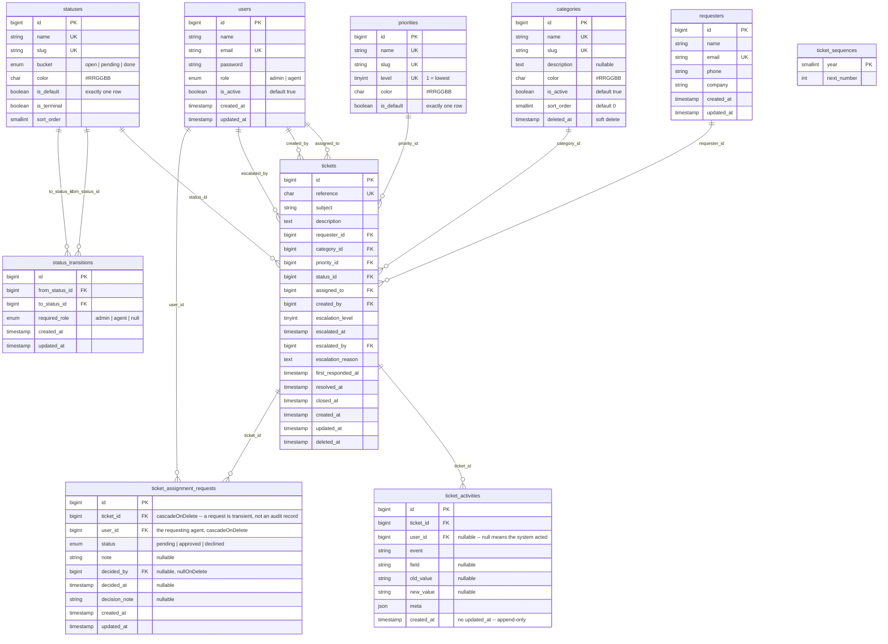

# Entity-Relationship Diagram

## Scope

The MySQL 8 schema behind the ticket-management app: users and roles, tickets,
master data (categories, priorities, statuses, status transitions), requesters,
and the audit trail. See `docs/ticket-lifecycle.md` for the workflow this
schema encodes.

## Diagram

## Table notes

| Table | Purpose | Owning story |
|-------|---------|--------------|
| `users` | Admin and agent logins; requesters are contact records. Role defaults to `agent` for least privilege. | TM-8 |
| `categories` | Ticket classification; admin-managed and soft-deleted. | TM-16 |
| `priorities` | Low/Medium/High/Urgent; `level` is escalation order. | TM-16 |
| `statuses` | Configurable workflow states. | TM-16 |
| `status_transitions` | The ticket lifecycle as data: one row per legal move, optionally role-gated. Seeded with 14 edges; editable at runtime. | TM-37 |
| `requesters` | Contact records for people tickets are about; no login capability. | TM-21 |
| `tickets` | Core soft-deleted record; foreign keys restrict except user references set null. | TM-21 |
| `ticket_sequences` | One row per year backing ticket references. | TM-21 |
| `ticket_activities` | Ticket audit trail: one row per event (`ticket_id`, `user_id` nullable, `event`, `field`, `old_value`, `new_value`, `meta` json, `created_at` only -- no `updated_at`). Never modified is enforced, not assumed: the model uses an append-only Eloquent builder that refuses every write but `insert` (TM-48), and `Ticket::forceDelete()` is refused because `ticket_id` is `ON DELETE CASCADE`. Changing that foreign key to `RESTRICT` is the complete fix and is recommended as its own story. | TM-45, TM-48 |
| `ticket_assignment_requests` | An agent's ask to be assigned an unassigned ticket, reviewed by an admin. Both foreign keys cascade on delete -- unlike every other table here, a request is a transient intention, not a durable audit record; the durable record is the `assignment_requested`/`assignment_request_declined` activity rows, which survive because `ticket_activities.user_id` is `nullOnDelete`. | — |

FULLTEXT index updates at commit; invisible inside open transaction. `innodb_ft_min_token_size = 3`.

Priority and status defaults use a unique index over a generated value. Flagged rows generate `1`; all other rows generate `NULL`, allowing many non-default rows but never two defaults.

`status_transitions` is unique on `(from_status_id, to_status_id)`; both foreign keys RESTRICT, so a status must lose its edges before it can be deleted.
